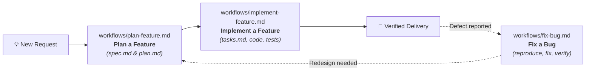
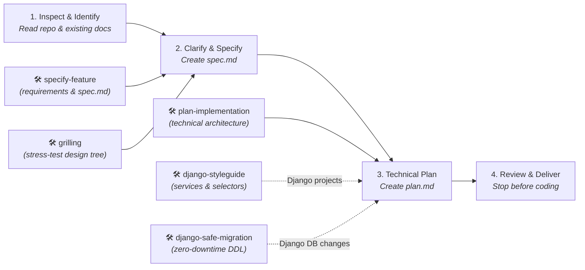
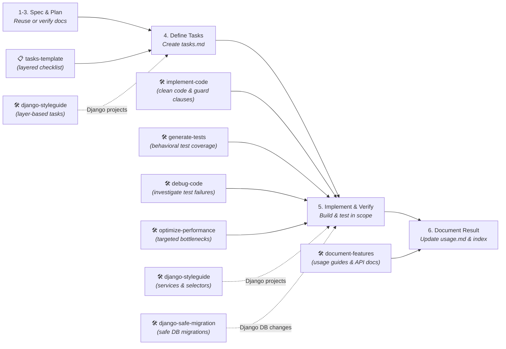
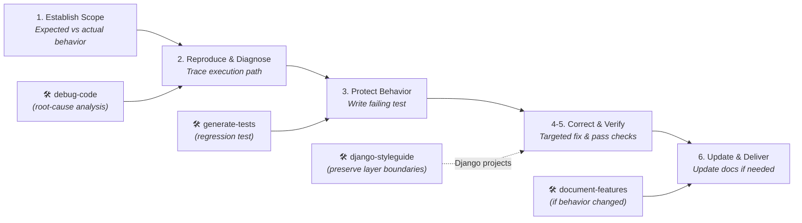

# Workflows

Reusable procedures that combine prompts, skills, agents, rules, or scripts to complete a task.

## Organization

Save each procedure in a Markdown file. If it includes an executable configuration, group it with its guide in its own folder.

## What to document

- Objective, requirements, and inputs.
- Steps in order, with relative links to the resources used.
- Decisions, human reviews, and external actions required by the process.
- Expected output and how to check it.
- How to continue or recover work if a step fails.

## Usage

Prepare the requirements and follow the steps in order. Check the result of each stage before moving on. If automation is available, review its configuration and effects before running it.

## Catalog

- [Plan a feature](plan-feature.md): produces the specification and technical plan under `docs/features/<feature>/`, stopping before task breakdown or code changes.
- [Implement a feature](implement-feature.md): connects specification, technical planning, tasks, implementation, verification, and documentation under `docs/features/<feature>/`.
- [Fix a bug](fix-bug.md): coordinates reproduction, diagnosis, regression coverage, a focused correction, and verification.

## Workflow lifecycle overview

The three workflows coordinate the software lifecycle from initial idea to maintenance:

---

## Detailed workflow diagrams and companion skills

### 1. Plan a feature (`plan-feature.md`)

Produces the specification and technical plan, stopping strictly before task breakdown and code changes.

---

### 2. Implement a feature (`implement-feature.md`)

Connects specification, planning, task execution, testing, and documentation into verified code.

---

### 3. Fix a bug (`fix-bug.md`)

Reproduces a reported defect, isolates the root cause, applies a focused correction, and verifies it.

---

## Skills and stages reference table

| Workflow | Stage / Step | Skill | Purpose |
| --- | --- | --- | --- |
| **Plan a feature** | 2. Clarify & specify | [Specify feature](../skills/specify-feature/SKILL.md) | Structure requirements, constraints, and verifiable acceptance criteria in `spec.md` |
| | 2. Clarify & specify | [Grilling](../skills/grilling/SKILL.md) | Stress-test assumptions and interview the user through the design tree to resolve ambiguities |
| | 3. Technical plan | [Plan implementation](../skills/plan-implementation/SKILL.md) | Design technical approach, affected files, architecture, risks, and checks in `plan.md` |
| | 3. Technical plan | [Django styleguide](../skills/django-styleguide/SKILL.md) | Apply Services (writes) and Selectors (reads) architecture in Django projects |
| | 3. Technical plan | [Django safe migration](../skills/django-safe-migration/SKILL.md) | Plan zero-downtime database schema modifications and non-blocking constraints |
| **Implement a feature** | 4. Define tasks | [Django styleguide](../skills/django-styleguide/SKILL.md) | Structure tasks into architectural layers (Models, Services, Selectors, APIs) using tasks template |
| | 5. Implement & verify | [Implement code](../skills/implement-code/SKILL.md) | Apply clean code practices, guard clauses, early return, and maintainable structure |
| | 5. Implement & verify | [Django styleguide](../skills/django-styleguide/SKILL.md) | Implement business operations as services and queries as selectors in Django |
| | 5. Implement & verify | [Django safe migration](../skills/django-safe-migration/SKILL.md) | Create, sequence, and verify safe database migrations without table locks |
| | 5. Implement & verify | [Generate tests](../skills/generate-tests/SKILL.md) | Create meaningful unit and integration test coverage for implemented behavior |
| | 5. Implement & verify | [Debug code](../skills/debug-code/SKILL.md) | Diagnose and resolve unexpected failures during implementation |
| | 5. Implement & verify | [Optimize performance](../skills/optimize-performance/SKILL.md) | Profile and eliminate bottlenecks when performance objectives require it |
| | 6. Document result | [Document features](../skills/document-features/SKILL.md) | Write usage guides in `usage.md` and keep shared project documentation up to date |
| **Fix a bug** | 2. Reproduce & diagnose | [Debug code](../skills/debug-code/SKILL.md) | Trace reachable code path and isolate root cause before editing |
| | 3. Regression test | [Generate tests](../skills/generate-tests/SKILL.md) | Write deterministic automated test that reproduces the defect and fails initially |
| | 4. Correct the cause | [Django styleguide](../skills/django-styleguide/SKILL.md) | Preserve layer boundaries: fix logic in services and queries in selectors |
| | 6. Update & deliver | [Document features](../skills/document-features/SKILL.md) | Update guides when defect resolution alters user-facing behavior or error handling |

[Back to index](../README.md)
